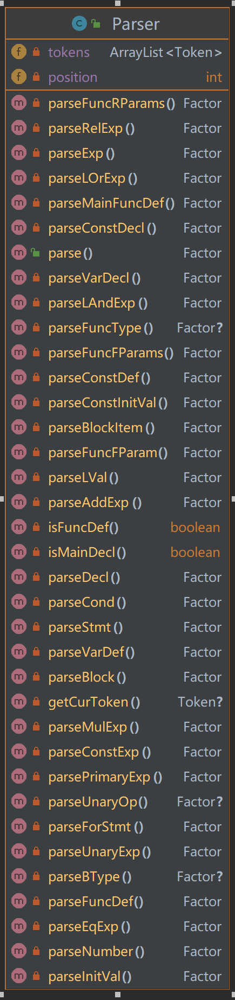

[TOC]

# **参考编译器介绍**

`PL/0`编译系统是一个编译`-`解释执行程序，整个编译过程分两个阶段进行。第一阶段先把`PL/0`源程序编译成假想计算机的目标程序（`P-code`指令），第二阶段再对该目标程序进行解释执行，得到运行结果。`PL/0`编译程序采用一遍扫描，即以语法分析为核心，由它调用词法分析程序取单词，在语法分析过程中同时进行语义分析处理，并生成目标指令。如遇到语法、语义错误，则随时调用出错处理程序，打印出错信息。在编译过程中要利用符号表的登录和查找来进行信息之间的联系。


# **总体设计介绍**

整体分为前端，中端和后端三部分。

前端由词法分析器`(Lexer)`、语法分析器`(Parser)`组成，主要是对输入的字符串进行预处理，建立出语法树。

中端包括语义分析器`(Visitor)`，符号表管理`(SymbolManager)`，集中进行错误处理并利用前端生成的语法树来生成中间代码，通过优化器`(Optimizer)`进行中间代码优化处理，将中间代码放入到中间代码容器中，通过解释执行程序`(VirtualMachine)`生成`LLVM`代码

后端包括目标翻译器`(Translater)`和存储管理`(ActivityRecord)`，将中间代码翻译成目标代码，即` MIPS` 代码，至此完成一个编译的基本过程。


# 一、**词法分析阶段设计**

#### 1、单词类别码定义

| 单词名称     | 类别码     | 单词名称 | 类别码   | 单词名称 | 类别码 | 单词名称 | 类别码  |
| ------------ | ---------- | -------- | -------- | -------- | ------ | -------- | ------- |
| Ident        | IDENFR     | !        | NOT      | *        | MULT   | =        | ASSIGN  |
| IntConst     | INTCON     | &&       | AND      | /        | DIV    | ;        | SEMICN  |
| FormatString | STRCON     | \|\|     | OR       | %        | MOD    | ,        | COMMA   |
| main         | MAINTK     | for      | FORTK    | <        | LSS    | (        | LPARENT |
| const        | CONSTTK    | getint   | GETINTTK | <=       | LEQ    | )        | RPARENT |
| int          | INTTK      | printf   | PRINTFTK | >        | GRE    | [        | LBRACK  |
| break        | BREAKTK    | return   | RETURNTK | >=       | GEQ    | ]        | RBRACK  |
| continue     | CONTINUETK | +        | PLUS     | ==       | EQL    | {        | LBRACE  |
| if           | IFTK       | -        | MINU     | !=       | NEQ    | }        | RBRACE  |
| else         | ELSETK     | void     | VOIDTK   |          |        |          |         |

#### 2、`Token`类设计

`Token`类是存放被读取到的一个词法单元的类，其类图如下：


其中`type`属性用来存储类别码，`value`属性用来存储具体的值

#### 3、`Lexer`类设计

`Lexer`类是用于分析词法的主类，其类图如下：


在`Lexer`类中，主方法是`parseText()`，当文本词法正确时返回`true`，否则返回`false`:

```java
public boolean parseText() {
        skipWhite();
        while (parseUnit()) {
            skipWhite();
        }
        return errorContent.length() == 0;
    }
```

在`parseUint()`类中，解析并存放一个词法单元到`tokenList`中，如果出现词法错误，则返回`false`并保存错误信息到`errorContent`：

```java
private boolean parseUnit() {
        skipWhite();
        tokenUnit = new StringBuffer();

        int ch = read();
        if (ch == -1) {
            //end of text
            return false;
        } else if (isLetter(ch) || ch == '_') {
            tokenUnit.append((char) ch);
            parseIdent();
            String type = signalTable.getSym(tokenUnit.toString());
            if (type == null) tokenList.add(new Token("IDENFR", tokenUnit.toString()));
            else tokenList.add(new Token(type, tokenUnit.toString()));
        } else if (isNum(ch)) {
            tokenUnit.append((char) ch);
            parseNum();
            tokenList.add(new Token("INTCON", tokenUnit.toString()));
        } else if (ch == '"') {
            tokenUnit.append((char) ch);
            parseString();
            if (tokenUnit.length() < 2) {
                //error
                errorContent = "There is an unknown signal " + tokenUnit.toString() + " in lines-" + lines;
                return false;
            } else if (tokenUnit.charAt(tokenUnit.length() - 1) != '"') {
                errorContent = "There is an unfinished formatString in lines-" + lines;
                return false;
            }
            tokenList.add(new Token("STRCON", tokenUnit.toString()));
        } else if (isLegalSig(ch)) {
            tokenUnit.append((char) ch);
            parseSignal();
            String type = signalTable.getSym(tokenUnit.toString());

            //not comments
            if (!tokenUnit.toString().equals("//") &&
                    !tokenUnit.toString().equals("/*")) {
                if (type != null) tokenList.add(new Token(type, tokenUnit.toString()));
                else {
                    //means error of single | or &
                    errorContent = "There is an unknown signal " + tokenUnit.toString() + " in lines-" + lines;
                    return false;
                }
            }
        } else {
            //error of un-known signal
            errorContent = "There is an unknown signal " + (char) ch + " in lines-" + lines;
            return false;
        }
        return true;
    }
```

其主要的状态流程图如下所示：


在主类`Complier`中新建`Lexer`类，将文本信息通过数组形式传入到`Lexer`类中，调用`parseText()`方法，即可完成对文本信息的词法解析，如果解析正确则可通过`getTokenList()`方法得到文本词法解析结果，否则可以通过`getErrorContent()`方法得到文本词法错误信息

# 二、**语法分析阶段设计**

#### 1、语法规则

```c++
编译单元 CompUnit → {Decl} {FuncDef} MainFuncDef 
声明 Decl → ConstDecl 
		 | VarDecl 
常量声明 ConstDecl → 'const' BType ConstDef { ',' ConstDef } ';' 
基本类型 BType → 'int' 
常数定义 ConstDef → Ident { '[' ConstExp ']' } '=' ConstInitVal 
常量初值 ConstInitVal → ConstExp
				    | '{' [ ConstInitVal { ',' ConstInitVal } ] '}' 
变量声明 VarDecl → BType VarDef { ',' VarDef } ';' 
变量定义 VarDef → Ident { '[' ConstExp ']' } 
			  | Ident { '[' ConstExp ']' } '=' InitVal
变量初值 InitVal → Exp 
			   | '{' [ InitVal { ',' InitVal } ] '}'
函数定义 FuncDef → FuncType Ident '(' [FuncFParams] ')' Block 
主函数定义 MainFuncDef → 'int' 'main' '(' ')' Block 
函数类型 FuncType → 'void' 
				| 'int' 
函数形参表 FuncFParams → FuncFParam { ',' FuncFParam } 
函数形参 FuncFParam → BType Ident ['[' ']' { '[' ConstExp ']' }] 
语句块 Block → '{' { BlockItem } '}' 
语句块项 BlockItem → Decl 
				 | Stmt 
语句 Stmt → LVal '=' Exp ';' 
		 | [Exp] ';' 
		 | Block
		 | 'if' '(' Cond ')' Stmt [ 'else' Stmt ] 
		 | 'for' '(' [ForStmt] ';' [Cond] ';' [forStmt] ')' Stmt
		 | 'break' ';' | 'continue' ';'
		 | 'return' [Exp] ';' 
		 | LVal '=' 'getint''('')'';'
		 | 'printf''('FormatString{','Exp}')'';' 
语句 ForStmt → LVal '=' Exp
表达式 Exp → AddExp 注：SysY 表达式是int 型表达式 
条件表达式 Cond → LOrExp 
左值表达式 LVal → Ident {'[' Exp ']'} 
基本表达式 PrimaryExp → '(' Exp ')' 
				    | LVal 
				    | Number 
数值 Number → IntConst 
一元表达式 UnaryExp → PrimaryExp 
				  | Ident '(' [FuncRParams] ')' 
				  | UnaryOp UnaryExp 
单目运算符 UnaryOp → '+' | '−' | '!' 注：'!'仅出现在条件表达式中 
函数实参表 FuncRParams → Exp { ',' Exp } 
乘除模表达式 MulExp → UnaryExp 
				 | MulExp ('*' | '/' | '%') UnaryExp 
加减表达式 AddExp → MulExp 
				| AddExp ('+' | '−') MulExp 
关系表达式 RelExp → AddExp 
				| RelExp ('<' | '>' | '<=' | '>=') AddExp 
相等性表达式 EqExp → RelExp 
				| EqExp ('==' | '!=') RelExp 
逻辑与表达式 LAndExp → EqExp 
				  | LAndExp '&&' EqExp 
逻辑或表达式 LOrExp → LAndExp 
				 | LOrExp '||' LAndExp 
常量表达式 ConstExp → AddExp 注：使用的Ident 必须是常量 

```

#### 2、`Factor`类设计

在语法分析阶段需要通过分析一段`Token`的序列来根据上述的文法规则建立起一棵以`CompUnit`为根节点的语法树，因此设计`Factor`类作来存储每个子节点的具体信息，其类图如下：


其中`type`属性用于存储该节点的名称，特别的，若该节点为叶节点，则其名称为`Token`，此时其`token`属性存放被分析到的对应的`token`值，若为非叶节点，则`token`属性保持为`null`。

#### 3、`Parser`类设计

`Parser`类是语法分析器类，主要对词法分析阶段得到的`tokens`序列进行进一步解析，从而生成语法树



对于每一种非终结符，都有其对应的`parse()`方法，主体思路是递归下降分析法，由于自顶向下分析不能适用于左递归文法，所以对左递归的文法规则进行了如下调整：

```c++
乘除模表达式 MulExp → UnaryExp { ('*' | '/' | '%') UnaryExp }
加减表达式 AddExp → MulExp { ('+' | '−') MulExp } 
关系表达式 RelExp → AddExp { ('<' | '>' | '<=' | '>=') AddExp }
相等性表达式 EqExp → RelExp { ('==' | '!=') RelExp }
逻辑与表达式 LAndExp → EqExp { '&&' EqExp }
逻辑或表达式 LOrExp → LAndExp { '||' LAndExp }
```

但为了最终使用深度优先搜索算法对语法树进行输出时与左递归文法保持一致，我每次读取到新的语法单元都会和上一次已经得到的语法单元进行合并，生成一个新的节点，这样就可以保证最终生成的语法树符合左递归文法，以`LOrExp`的解析方法为例：

```java
private Factor parseLOrExp() {
        Factor lOrExp = new Factor("LOrExp");
        lOrExp.addChild(parseLAndExp());
        Factor ret = lOrExp;
        while (getCurToken().getValue().equals("||")) {
            ret = new Factor("LOrExp");
            ret.addChild(lOrExp);
            ret.addChild(new Factor(getCurToken()));
            position++;
            ret.addChild(parseLAndExp());
            lOrExp = ret;
        }
        return ret;
    }
```

对于向下解析时会有多种选择的非终结符，如`Stmt`，采用先分析每种选择的`FIRST`集的方法：

```c++
语句 Stmt → LVal '=' Exp ';'	// {'Ident'}
		 | [Exp] ';'	// {'(' , 'Number' , 'Ident' , '+' , '-' ,'!'}
		 | Block	// {'{'}
		 | 'if' '(' Cond ')' Stmt [ 'else' Stmt ]	// {'if'}
		 | 'for' '(' [ForStmt] ';' [Cond] ';' [forStmt] ')' Stmt	// {'for'}
		 | 'break' ';'	// {'break'}
		 | 'continue' ';'	// {'continue'}
		 | 'return' [Exp] ';'	// {'return'}
		 | LVal '=' 'getint''('')'';'	// {'Ident'}
		 | 'printf''('FormatString{','Exp}')'';'	// {'printf'} 
```

可以看到，如果当前`token`不是`Ident`时，都会有对应的唯一的选择，如果是`Ident`，则会出现三种情况，此时不可避免要采用回溯的办法：

```c++
语句 Stmt → LVal '=' Exp ';'
		 | [Exp] ';'
		 | LVal '=' 'getint''('')'';'
```

由于`Exp`可以推出`LVal`，所以一种朴素的思想是，我可以尝试解析`Exp`，当解析完成后再分析下一个符号是`=`还是`;`，如果是前一种情况，那么可以判断是第一种、第三种推导方式，否则是第二种推导方式，此时再进行回溯按照正确的规则重新推导即可

# 三、**错误处理**

#### 1、错误类别码

|               错误类型               | 错误类别码 |                             解释                             |       对应文法及出错符号 ( … 表示省略该条规则后续部分)       |
| :----------------------------------: | :--------: | :----------------------------------------------------------: | :----------------------------------------------------------: |
|               非法符号               |     a      | 格式字符串中出现非法字符报错行号为 **<FormatString>** 所在行数。 |                <FormatString> → ‘“‘{<Char>}’”                |
|              名字重定义              |     b      | 函数名或者变量名在**当前作用域**下重复定义。注意，变量一定是同一级作用域下才会判定出错，不同级作用域下，内层会覆盖外层定义。报错行号为 **<Ident>** 所在行数。 | <ConstDef>→<Ident> … <VarDef>→<Ident> … <Ident> … <FuncDef>→<FuncType><Ident> … <FuncFParam> → <BType> <Ident> … |
|             未定义的名字             |     c      |    使用了未定义的标识符报错行号为 **<Ident>** 所在行数。     |            <LVal>→<Ident> … <UnaryExp>→<Ident> …             |
|          函数参数个数不匹配          |     d      | 函数调用语句中，参数个数与函数定义中的参数个数不匹配。报错行号为函数调用语句的**函数名**所在行数。 |           <UnaryExp>→<Ident>‘(’[<FuncRParams>]‘)’            |
|          函数参数类型不匹配          |     e      | 函数调用语句中，参数类型与函数定义中对应位置的参数类型不匹配。报错行号为函数调用语句的**函数名**所在行数。 |           <UnaryExp>→<Ident>‘(’[<FuncRParams>]‘)’            |
| 无返回值的函数存在不匹配的return语句 |     f      |              报错行号为 **‘return’** 所在行号。              |               <Stmt>→‘return’ {‘[’<Exp>’]’}‘;’               |
|     有返回值的函数缺少return语句     |     g      | 只需要考虑函数末尾是否存在return语句，**无需考虑数据流**。报错行号为函数**结尾的’}’** 所在行号。 | <FuncDef> → <FuncType> <Ident> ‘(’ [<FuncFParams>] ‘)’ <Block> <MainFuncDef> → ‘int’ ‘main’ ‘(’ ‘)’ <Block> |
|           不能改变常量的值           |     h      | <LVal>为常量时，不能对其修改。报错行号为 **<LVal>** 所在行号。 | <Stmt>→<LVal>‘=’ <Exp>‘;’ <Stmt>→<LVal>‘=’ ‘getint’ ‘(’ ‘)’ ‘;’ |
|               缺少分号               |     i      |          报错行号为分号**前一个非终结符**所在行号。          |             <Stmt>,<ConstDecl>及<VarDecl>中的’;’             |
|           缺少右小括号’)’            |     j      |        报错行号为右小括号**前一个非终结符**所在行号。        |   函数调用(<UnaryExp>)、函数定义(<FuncDef>)及<Stmt>中的’)’   |
|           缺少右中括号’]’            |     k      |        报错行号为右中括号**前一个非终结符**所在行号。        | 数组定义(<ConstDef>,<VarDef>,<FuncFParam>)和使用(<LVal>)中的’]’ |
|  printf中格式字符与表达式个数不匹配  |     l      |              报错行号为 **‘printf’** 所在行号。              |       <Stmt> →‘printf’‘(’<FormatString>{,<Exp>}’)’‘;’        |
| 在非循环块中使用break和continue语句  |     m      |     报错行号为 **‘break’** 与 **’continue’** 所在行号。      |            <Stmt>→‘break’‘;’ <Stmt>→‘continue’‘;’            |

#### 2、可能存在的错误对应关系

```java
编译单元    CompUnit → {Decl} {FuncDef} MainFuncDef  
声明  Decl → ConstDecl | VarDecl
常量声明    ConstDecl → 'const' BType ConstDef { ',' ConstDef } ';' // i
基本类型    BType → 'int'
常数定义    ConstDef → Ident { '[' ConstExp ']' } '=' ConstInitVal  // b k
常量初值    ConstInitVal → ConstExp
    | '{' [ ConstInitVal { ',' ConstInitVal } ] '}' 
变量声明    VarDecl → BType VarDef { ',' VarDef } ';' // i
变量定义    VarDef → Ident { '[' ConstExp ']' } // b
    | Ident { '[' ConstExp ']' } '=' InitVal // k
变量初值    InitVal → Exp | '{' [ InitVal { ',' InitVal } ] '}'
函数定义    FuncDef → FuncType Ident '(' [FuncFParams] ')' Block // b g j
主函数定义   MainFuncDef → 'int' 'main' '(' ')' Block // g j
函数类型    FuncType → 'void' | 'int' 
函数形参表   FuncFParams → FuncFParam { ',' FuncFParam } 
函数形参    FuncFParam → BType Ident ['[' ']' { '[' ConstExp ']' }]  //   b k
语句块     Block → '{' { BlockItem } '}' 
语句块项    BlockItem → Decl | Stmt 
语句  Stmt → LVal '=' Exp ';' | [Exp] ';' | Block // h i
    | 'if' '(' Cond ')' Stmt [ 'else' Stmt ] // j
    | 'for' '('[ForStmt] ';' [Cond] ';' [ForStmt] ')' Stmt // j
    | 'break' ';' | 'continue' ';' // i m
    | 'return' [Exp] ';' // f i
    | LVal '=' 'getint''('')'';' // h i j
    | 'printf''('FormatString{,Exp}')'';' // i j l
语句 ForStmt → LVal '=' Exp   //h
表达式 Exp → AddExp 注：SysY 表达式是int 型表达式 
条件表达式   Cond → LOrExp 
左值表达式   LVal → Ident {'[' Exp ']'} // c k
基本表达式   PrimaryExp → '(' Exp ')' | LVal | Number 
数值  Number → IntConst 
一元表达式   UnaryExp → PrimaryExp | Ident '(' [FuncRParams] ')' // c d e j
        | UnaryOp UnaryExp 
单目运算符   UnaryOp → '+' | '−' | '!' 注：'!'仅出现在条件表达式中 
函数实参表   FuncRParams → Exp { ',' Exp } 
乘除模表达式  MulExp → UnaryExp | MulExp ('*' | '/' | '%') UnaryExp 
加减表达式   AddExp → MulExp | AddExp ('+' | '−') MulExp 
关系表达式   RelExp → AddExp | RelExp ('<' | '>' | '<=' | '>=') AddExp
相等性表达式  EqExp → RelExp | EqExp ('==' | '!=') RelExp
逻辑与表达式  LAndExp → EqExp | LAndExp '&&' EqExp
逻辑或表达式  LOrExp → LAndExp | LOrExp '||' LAndExp 
常量表达式   ConstExp → AddExp 注：使用的Ident 必须是常量
格式字符串:
<FormatString> → '"'{<Char>}'"' // a
```

#### 3、符号表建立

首先是符号类：


其中`name`字段存储标识符名称，`type`存储数据类型，`kind`存储标识符类型，即`INT`，`CON`，`FUNC`三种类型，`dimension`存储维数信息，若为`void`特定规定为 -1 维，int 类型规定为 0 维，数组类型即为相应的数组维数，`otherInfo`存储附加信息，例如函数的参数个数和每个参数的类型等

符号表类：


采用`LinkedHashMap`既可以保证查询的高效性又可以按照插入顺序保证数据有序，考虑到同一级符号表内标识符的名称具有唯一性，使用标识符名称作为`key`，标识符本身作为`value`

符号栈类：


整体的关系是符号表中使用`HashMap`存储符号，在符号栈中使用`ArrayList`创建一个存储若干符号表的栈结构。

当需要检索符号定义时，从栈顶向栈底依次检索，特别的，若需要检索的符号是函数标识符，则直接在栈底检索即可。

当有新的标识符要被加入到符号表时，先进行符号检索，确定符号是否重定义，再取栈顶的符号表并加入符号。

每当进入一个新的`Block`，即进入一个新的作用域，就在栈顶加入一个新的符号表，每当退出`Block`就弹出栈顶的符号表。

#### 4、处理方法

错误信息类：


其中`lines`表示错误出现的行号，`code`表示错误类别码，重写了`toString`方法用于错误信息的输出，重写`equals`方法和`compareTo`方法用于对错误信息按行号排序

a 类错误：直接在`Lexer`类中进行词法解析时检测该错误即可

b 类错误：在定义新的标识符时检测该错误

```java
if (tableStack.isReDefined(curSymbol.getName())) {
    errors.add(new Error(lines, 'b'));
} else {
    tableStack.peek().addSymbol(curSymbol);
}
```

c 类错误：在使用标识符时检测该错误

```java
Symbol symbol = tableStack.searchFuncSymbol(getCurToken().getValue());
if (symbol == null) {
    errors.add(new Error(lines, 'c'));
}
```

d 类错误：在解析`UnaryExp`中发现是函数调用时检测实参和形参个数是否匹配，实参个数即为`FuncRParams`下`Exp`的个数，若没有`FuncRParams`，则实参个数为 0

e 类错误：同 d 类错误，检测实参和形参类型是否匹配，直接检测维数即可

```java
public boolean isLegalFuncRParams(Symbol funcFSymbol, SymbolTableStack tableStack) {
    ArrayList<Symbol> funcFParams = funcFSymbol.getOtherInfo().getParaTypes();
    for (int i = 0; i < funcFParams.size() && 2 * i < children.size(); i++) {
        Factor exp = children.get(2 * i);
        Symbol funcRPara = funcFParams.get(i);
        int dimension = exp.getDimension(tableStack);
        if (dimension != funcRPara.getDimension()) {
            return false;
        }
    }
    return true;
}
```

f 类错误：在函数定义中检测，若函数类型为`void`，则对解析到的`Block`进行检测，若检测到了`return Exp`，就会报错

```java
//Block
public boolean hasReturnSomething() {
    if (children.size() - 2 <= 0) return false;
    for(int i = 1; i < children.size() - 1; i++) {
        Factor factor = children.get(children.size() - 2);
        ArrayList<Token> tokens = factor.toTokenList();
        if (tokens.size() >= 2 
            && tokens.get(0).getValue().equals("return") 
            && !tokens.get(1).getValue().equals(";")) {
            return true;
        }
    }
    return false;
}

```

g 类错误：在函数定义中检测，与 f 类错误同理，不过只检测`Block`中最后一个`BlockItem`即可，对`int`型函数，只要在末尾存在`return`就不会报错

```java
//Block
public boolean hasReturn() {
    if (children.size() - 2 < 0) return false;
    Factor factor = children.get(children.size() - 2);

    ArrayList<Token> tokens = factor.toTokenList();
    if (tokens.get(0).getValue().equals("return")) {
        return true;
    }
    return false;
}
```

h 类错误：在赋值语句中检测，若标识符类型为`CON`，表示该标识符为常量，需要报错

```java
if (getCurToken().getValue().equals("=")) {
    Factor lVal = stmt.getLastChildren();
    Symbol symbol = tableStack.searchSymbol(lVal.toTokenList().get(0).getValue());
    if (symbol != null && symbol.getKind() == CON) {
        errors.add(new Error(lVal.getBeginLine(), 'h'));
    }
    stmt.addChild(new Factor(getCurToken()));
    position++;
}
```

i 类错误：检测`;`即可，若本该出现`;`的地方没有出现，就报错

j 类错误：同 i 类错误

k 类错误：同 i 类错误

l 类错误：检测`printf`语句中参数个数，即`Exp`的个数，若不等于其`FormatString`中`%d`的个数就报错

m 类错误：在进入`for`语句时让`count++`，当退出`for`语句时让`count--`，这样可以保证当`count > 0`时，一定是在`for`语句的内部，否则是在`for`语句的外部，此时若出现了`break`或者`continue`就报错即可

```java
if (nowValue.equals("for")) {
    inForDepth++;
    ...
    inForDepth--;
} else if (nowValue.equals("break")) {
    if (inForDepth <= 0) {
        errors.add(new Error(getCurToken().getLines(), 'm'));
    }
    ...   
} else if (nowValue.equals("continue")) {
    if (inForDepth <= 0) {
        errors.add(new Error(getCurToken().getLines(), 'm'));
    }
    ...
}
```

